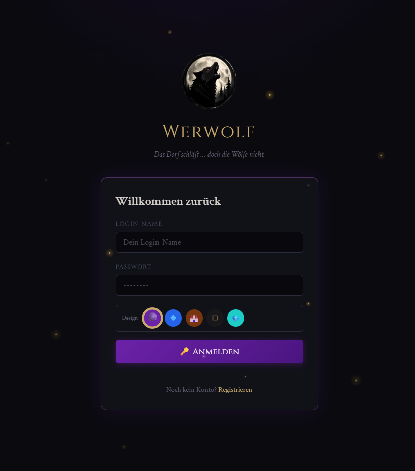

# 🐺 Werwolf — Web-App



Browserbasiertes Werwolf-Spiel. PHP + MySQL + Apache 2.
Responsiv für Desktop und Handy. Direkt unter der Domain erreichbar (kein Unterordner nötig).

---

## 📁 Ordnerstruktur

```
/var/www/html/          ← Document Root (Inhalt des Projekts direkt hier)
├── index.php           ← Login
├── register.php        ← Registrierung (3-Schritt-Wizard)
├── game.php            ← Spielfeld
├── deaths.php          ← Todesliste
├── roles.php           ← Öffentliche Rollenübersicht
├── stats.php           ← Spielstatistiken
├── faq.php             ← FAQ
├── datenschutz.php     ← Datenschutzerklärung
├── impressum.php       ← Impressum
├── nutzungsbedingungen.php ← Nutzungsbedingungen
├── logout.php
├── sw.js               ← Service Worker (Web-Push)
├── CHANGELOG.md        ← Versionshistorie / Backup-Changelog
│
├── admin/              ← Admin-Bereich (nur für eingeloggte Admins zugänglich)
│   ├── index.php       ← Spielleitung (Phasenwechsel, Rollen verteilen, Spieler töten)
│   ├── roles.php       ← Rollen verwalten (CRUD + Icon-Upload)
│   ├── players.php     ← Spielerverwaltung (Übersicht, löschen, Passwort ändern)
│   ├── messages.php    ← Spielerfragen beantworten
│   ├── settings.php    ← Server-Einstellungen (DB-konfigurierbar)
│   ├── setup.php       ← 5-Schritt-Wizard: DB einrichten + Admin-Konto wählen (kein Login nötig)
│   ├── testplayers.php ← Testdaten: Spieler schnell anlegen
│   └── diagnostics.php ← System-Diagnose: PHP, DB, Dateien, URL-Test, KI-Fehlerbericht
│
├── api/                ← JSON-Endpunkte, vom JS aufgerufen
│   ├── game.php            ← join, get_players, vote, self_report_death, update_death_info, get_log
│   ├── admin.php           ← Spielsteuerung + Rollen-CRUD
│   ├── messages.php        ← Spieler-Fragen senden/empfangen + Admin-Antworten
│   ├── push.php            ← Web-Push-Abonnement verwalten + Benachrichtigungen senden
│   ├── upload_role_icon.php    ← Icon-Upload + PNG/JPG→SVG-Konvertierung
│   ├── upload_logo.php         ← Login-Logo hochladen
│   └── upload_favicon.php      ← Browser-Favicon hochladen
│
├── config/
│   ├── config.php      ← ALLE Einstellungen: DB, App-Name, Limits, Setup-Passwort
│   └── themes.php      ← Theme-Registry + getActiveTheme()
│
├── core/               ← PHP-"Engine", kein HTML
│   ├── bootstrap.php   ← wird von JEDER Seite zuerst eingebunden
│   ├── Database.php    ← PDO-Singleton + Query-Helfer
│   ├── Auth.php        ← Login/Session/Schutz
│   ├── WebPush.php     ← Web-Push-Logik (VAPID-Keys, Payload senden)
│   └── helpers.php     ← globale Funktionen (e(), jsonResponse(), Rollen-Helper, recordDeath(), …)
│
├── templates/
│   ├── base.php            ← <head> + Theme-Laden + öffnet <body>
│   ├── base_end.php        ← schließt </body>, lädt JS
│   ├── nav.php             ← Navigation (Top-Bar + Unternavigation, alle Seiten)
│   └── role_form_fields.php ← wiederverwendbares Formular (Erstellen + Bearbeiten)
│
├── assets/
│   ├── css/
│   │   ├── app.css         ← Theme-unabhängige Basis (Layout, Komponenten)
│   │   └── themes/
│   │       ├── gothic.css    ← Düster, Mondlicht (Standard)
│   │       ├── vista.css     ← Windows-Aero-Glas, Blau
│   │       ├── medieval.css  ← Pergament, Holz
│   │       ├── minimal.css   ← Schwarz-Weiß, clean
│   │       └── crystal.css   ← JRPG-Ästhetik, Final Fantasy VII–IX
│   ├── js/
│   │   ├── app.js          ← API-Helper, Toast, LocalStorage, Theme-Switch
│   │   └── effects.js      ← Visuelle Effekte (Partikel, Nebel, Phasenübergänge)
│   └── icons/roles/        ← Rollen-Icons (SVG/PNG), inkl. .htaccess-Schutz
│
├── audio/              ← Hintergrundmusik (MP3)
│
├── db/
│   ├── schema.sql          ← Quelle für setup.php (DROP + CREATE, sauberer Reset)
│   ├── init.sql            ← Alternative für CLI (CREATE IF NOT EXISTS, kein Reset)
│   ├── migration_roles.sql         ← Rollen-Tabellen-Erweiterungen
│   ├── migration_settings.sql      ← settings-Tabelle nachrüsten
│   ├── migration_messages.sql      ← Nachrichten-System
│   ├── migration_push.sql          ← Web-Push-Abonnements
│   ├── migration_slogans.sql       ← Tages-Slogans-Einstellung
│   ├── migration_timezone.sql      ← Zeitzone-Einstellung
│   ├── migration_zeit.sql          ← Todesuhrzeit in Todesliste
│   ├── migration_befragen.sql      ← Nekromant-Befragen-Funktion
│   ├── migration_faq.sql           ← FAQ-Seite
│   ├── migration_star.sql          ← Star-Rolle (auto_eintrag-Spalte)
│   ├── migration_superstar.sql     ← Superstar-Rolle
│   ├── migration_rename_icons.sql  ← Icon-Pfade umbenennen
│   ├── migration_fix_logo_path.sql ← Logo-Pfad korrigieren
│   ├── migration_beta.sql          ← Beta-Modus-Einstellung
│   ├── migration_remove_cause.sql  ← cause-Spalte entfernt, is_gehenkt + rolle_aufgedeckt ergänzt
│   ├── migration_cooldown.sql      ← cooldown_started_at in game_players ergänzt
│   └── migration_killer.sql        ← is_killer-Flag in roles ergänzt
│
├── public/             ← Backups (ZIP-Dateien, nicht im Web zugänglich)
│
├── .htaccess           ← schützt config/core/templates/db vor Web-Zugriff
└── README.md           ← diese Datei
```

**Designprinzip:** Trennung von **Konfiguration** (`config/`), **Logik**
(`core/`, `api/`), **Darstellung** (`templates/`, `assets/`) und
**Einstiegspunkten** (Wurzelverzeichnis + `admin/`). Jede Datei hat genau eine Aufgabe.

---

## 🚀 Setup

### 1. Datenbank-Zugang

Alles in **einer** Datei: `config/config.php`

```php
define('DB_HOST', 'DB');          // Docker-Service-Name oder IP
define('DB_PORT', '3306');
define('DB_NAME', 'werwolf');
define('DB_USER', 'root');
define('DB_PASS', '**********');
```

Für einen anderen Server: nur diese vier Zeilen ändern. Der Rest der App
greift ausschließlich über `Database::get()` / `Database::query()` zu —
nirgendwo sonst stehen Zugangsdaten.

### 2. Datenbank einrichten

**Empfohlen — 5-Schritt-Wizard:** Im Browser aufrufen (kein Login nötig, läuft auch auf leerer DB):

```
http://deine-domain.de/admin/setup.php
```

Der Wizard führt durch diese Schritte:

1. **Zugang** — Setup-Passwort eingeben (`SETUP_PASSWORD` aus `config/config.php`, Standard: `setup`)
2. **Verbindung** — DB-Verbindung wird automatisch geprüft (MySQL-Version, DB vorhanden?)
3. **Admin-Konto** — Benutzername und Passwort für den Admin frei wählen
4. **Bestätigung** — Warnung vor Datenverlust, `LÖSCHEN` eintippen
5. **Einrichtung** — `db/schema.sql` wird ausgeführt, Fortschrittsbalken zeigt jeden Schritt live

Am Ende ist die Datenbank fertig und das Admin-Konto mit den selbst gewählten Daten angelegt.

**SETUP_PASSWORD** unbedingt in `config/config.php` auf ein sicheres Passwort setzen —
die Seite ist ohne App-Login erreichbar!

```php
define('SETUP_PASSWORD', 'mein-sicheres-passwort');   // Standard: 'setup' — ändern!
```

**Alternative — Kommandozeile:**

```bash
mysql -h DB -u root -p < db/init.sql
```

Bei der CLI-Variante wird der Standard-Admin `admin` / `password` angelegt —
bitte nach dem ersten Login sofort ändern.

### 3. Deployment

Den **gesamten Inhalt** dieses Ordners direkt nach `/var/www/html/` (oder
den konfigurierten Document Root) hochladen. Keine Unterordner nötig —
die App ist dann direkt unter der Domain erreichbar:

```
https://deine-domain.de/          ← Login
https://deine-domain.de/game.php  ← Spielfeld
https://deine-domain.de/admin/    ← Spielleitung
```

Apache muss `AllowOverride All` für `.htaccess`-Unterstützung haben sowie
die Module `mod_alias` und `mod_headers` aktiv.

**`.htaccess` schützt automatisch:**
- Verzeichnislisten überall deaktiviert (`Options -Indexes`)
- Gesperrte Ordner (HTTP 403): `config/`, `core/`, `templates/`, `db/`, `docs/`
- Gesperrte Dateitypen: `*.sql`, `*.md`, `*.log`, `*.bak`, `*.env`, `.htaccess` selbst
- Sicherheits-Header: `X-Content-Type-Options`, `X-Frame-Options`, `Referrer-Policy`, `X-XSS-Protection`
- `game.php`, `admin/`, `api/` sind per PHP-Auth geschützt (`Auth::requireLogin` / `Auth::requireAdmin`)

### 4. Docker-Compose (mit HTTPS / Let's Encrypt)

Die produktionsreife Variante nutzt Let's Encrypt für automatische SSL-Zertifikate.

**Zusätzliche Dateien neben `docker-compose.yml`:**

```
docker/
└── apache/
    └── vhost.conf    ← Apache-VHost-Konfiguration (HTTP-Redirect + HTTPS)
```

**`docker-compose.yml`:**

```yaml
services:
  webserver:
    image: php:8.2-apache
    container_name: mein_webserver
    ports:
      - "80:80"
      - "443:443"
    volumes:
      - ./html:/var/www/html
      - ./docker/apache/vhost.conf:/etc/apache2/sites-available/000-default.conf
      - certbot_certs:/etc/letsencrypt
      - certbot_www:/var/www/certbot
    entrypoint: ["sh", "-c", "docker-php-ext-install pdo pdo_mysql && a2enmod ssl rewrite headers && apache2-foreground"]
    depends_on:
      - db
    restart: always

  certbot:
    image: certbot/certbot
    volumes:
      - certbot_certs:/etc/letsencrypt
      - certbot_www:/var/www/certbot
    command: renew

  db:
    image: mariadb:latest
    container_name: meine_datenbank
    ports:
      - "3306:3306"
    environment:
      MYSQL_ROOT_PASSWORD: PASSWORT
      MYSQL_DATABASE: werwolf
      MYSQL_USER: werwolf
      MYSQL_PASSWORD: PASSWORT
    volumes:
      - db_data:/var/lib/mysql
    restart: always

volumes:
  db_data:
  certbot_certs:
  certbot_www:
```

**`docker/apache/vhost.conf`:**

```apache
<VirtualHost *:80>
    DocumentRoot /var/www/html

    Alias /.well-known/acme-challenge/ /var/www/certbot/.well-known/acme-challenge/
    <Directory /var/www/certbot/.well-known/acme-challenge/>
        Options None
        AllowOverride None
        Require all granted
    </Directory>

    RewriteEngine On
    RewriteCond %{REQUEST_URI} !^/.well-known/acme-challenge/
    RewriteRule ^(.*)$ https://%{HTTP_HOST}$1 [R=301,L]
</VirtualHost>

<VirtualHost *:443>
    DocumentRoot /var/www/html

    SSLEngine on
    SSLCertificateFile    /etc/letsencrypt/live/DEINE-DOMAIN/fullchain.pem
    SSLCertificateKeyFile /etc/letsencrypt/live/DEINE-DOMAIN/privkey.pem

    <Directory /var/www/html>
        AllowOverride All
        Require all granted
    </Directory>

    ErrorLog  ${APACHE_LOG_DIR}/error.log
    CustomLog ${APACHE_LOG_DIR}/access.log combined
</VirtualHost>
```

`DEINE-DOMAIN` in `vhost.conf` durch die echte Domain ersetzen.

**Erstmalige Einrichtung (einmalig):**

```bash
# 1. Container starten (Webserver läuft zunächst nur auf HTTP)
docker compose up -d

# 2. SSL-Zertifikat holen (Webserver muss dabei laufen — Webroot-Methode)
docker compose run --rm certbot certonly \
  --webroot -w /var/www/certbot \
  -d deine-domain.de \
  --email deine@email.de \
  --agree-tos --no-eff-email

# 3. Webserver neu starten → lädt jetzt das Zertifikat
docker compose restart webserver
```

**Automatische Zertifikatserneuerung** (Cron-Job auf dem Host):

```bash
crontab -e
# Eintragen — läuft täglich um 03:00 Uhr:
0 3 * * * cd /pfad/zum/projekt && docker compose run --rm certbot renew && docker compose restart webserver
```

> **Hinweis:** Let's Encrypt erfordert eine öffentlich erreichbare Domain (Port 80 muss von außen erreichbar sein). Für reine Entwicklungsserver ohne öffentliche Domain stattdessen ein self-signed Zertifikat verwenden.

---

## 🎨 Theme-System

5 Themes, zentral definiert in `config/themes.php`:

| Key | Name | Stil |
|---|---|---|
| `gothic`   | Gothic      | Düster, Mondlicht, Cinzel-Schrift (**Standard**) |
| `vista`    | Vista       | Windows-Aero-Glasmorphism, Königsblau |
| `medieval` | Mittelalter | Pergament, Holz, Frakturschrift |
| `minimal`  | Minimal     | Schwarz-Weiß, clean, Space Grotesk |
| `crystal`  | Crystal     | JRPG-Ästhetik, Final Fantasy VII/VIII/IX, Navy/Teal |

**Ein Theme hinzufügen:**
1. Neue CSS-Datei unter `assets/css/themes/<name>.css` — definiert dieselben
   CSS-Variablen wie die anderen (siehe `gothic.css` als Vorlage).
2. Eintrag in `config/themes.php` im `THEMES`-Array ergänzen.
3. Fertig — taucht automatisch in der Theme-Auswahl auf.

Theme wird per Cookie (`ww_theme`) gespeichert, serverseitig in
`getActiveTheme()` ausgelesen, kein JavaScript-Flackern beim Laden.

---

## 🎮 DB-konfigurierbare Einstellungen (`admin/settings.php`)

Diese Werte werden in der Tabelle `settings` gespeichert und gelten sofort
ab dem nächsten Seitenaufruf — kein Datei-Edit nötig:

| Einstellung | Bedeutung |
|---|---|
| `app_name` | Anzeigename der App |
| `app_version` | Versionsnummer (z. B. `0.0.2`) |
| `app_debug` | PHP-Fehler anzeigen (im Produktivbetrieb deaktivieren) |
| `beta_mode` | Beta-Hinweis im Spielfenster ein-/ausschalten |
| `default_theme` | Standard-Theme für neue Nutzer |
| `login_title` / `login_subtitle` | Texte auf der Anmeldeseite |
| `register_subtitle` | Text auf der Registrierungsseite |
| `min_players` / `max_players` | Spielerzahl-Grenzen |
| `background_music` | Dateiname in `assets/audio/` (leer = kein Player) |
| `default_role_icon` | Fallback-Icon-Pfad für Rollen ohne eigenes Icon |
| `session_lifetime` | Anmeldedauer in Sekunden |
| `deaths_empty_title` / `deaths_empty_sub` | Texte auf leerer Todesliste |
| `deaths_peace_text` | Text unter dem Friedhof-Bereich |
| `login_logo` / `mini_logo` | Logo + Favicon (Pfade, via Upload gesetzt) |
| `game_timezone` | PHP-Zeitzone (z. B. `Europe/Berlin`) |
| `day_slogans` | Zufallssprüche im Tages-Banner (eine Zeile = ein Slogan) |

---

## 🧩 Spielablauf

1. **Lobby:** Spieler registrieren sich über den 3-Schritt-Wizard (`/register.php`:
   Name prüfen → Passwort mit Stärke-Anzeige → animierte Registrierung), loggen sich ein
   und treten bei oder werden vom Admin hinzugefügt (`/admin/`).
2. **Spielstart:** Admin verteilt Rollen und startet das Spiel.
3. **Tag:** Alle stimmen ab → Admin klickt „Abstimmung auswerten".
4. **Nacht:** Admin wechselt Phase, wertet Nacht aus oder tötet manuell.
5. Wiederholt sich, bis Admin „Spiel beenden" klickt.

### Tote befragen (Nekromant-Funktion)

Ist eine Rolle mit `befragen=1` (z. B. Nekromant) **lebendig** im Spiel, sehen tote
Spieler auf der Todesliste (`deaths.php`) einen **📋 Eintragen**-Button bei ihrem
eigenen Eintrag. Darüber können sie Rolle, Ort und Todeszeit selbst nachtragen.
Nach dem Speichern ist der Eintrag für alle sichtbar (`rolle_aufgedeckt=1`).

- Der Button verschwindet, sobald der Eintrag ausgefüllt wurde.
- Die **Star-Rolle** (`auto_eintrag=1`) setzt `rolle_aufgedeckt=1` sofort beim Sterben —
  vollständig unabhängig davon, ob ein Nekromant lebt.
- Technisch: `api/game.php` → `update_death_info` aktualisiert `ort`, `zeit` und `role_id`,
  setzt `rolle_aufgedeckt=1`.

### Spieler-Nachrichten

Spieler können über das Spielfenster Fragen an den Spielleiter stellen.
Der Admin beantwortet diese unter `admin/messages.php`. Neue Antworten
werden dem Spieler per Badge und Toast-Meldung signalisiert.

### Web-Push-Benachrichtigungen

Spieler können Push-Benachrichtigungen aktivieren. Der Admin kann Meldungen
aus dem Admin-Bereich versenden (z. B. Phasenwechsel). Technisch über
`core/WebPush.php` + `api/push.php` + `sw.js` (Service Worker).

### Rollen — vollständig datenbankgesteuert (Tabelle `roles`)

Rollen stehen **nicht im Code**, sondern komplett in der Tabelle `roles`.
Der Admin verwaltet sie unter **`/admin/roles.php`** — Erstellen, Bearbeiten,
Aktivieren/Deaktivieren, Löschen, alles per Formular.

| Spalte | Bedeutung |
|---|---|
| `name` | Anzeigename |
| `cooldown` | Minuten bis zur nächsten Nutzung (0 = keine) |
| `description` | Rollenbeschreibung für den Spieler |
| `rules` | Regeltext |
| `active` | 1 = verfügbar, 0 = deaktiviert |
| `fill` | 1 = Füllrolle (übrige Spieler bekommen diese Rolle automatisch) |
| `amount` | Anzahl pro Spiel (bei fill=0) |
| `icon_path` | Pfad zur Icon-Datei |
| `sichtbar` | 1 = Spieler mit gleicher Rolle erkennen sich gegenseitig |
| `befragen` | 1 = Diese Rolle darf tote Spieler befragen (Tote können eigene Rolle, Ort und Zeit in die Todesliste eintragen) |
| `auto_eintrag` | 1 = Todesort/-zeit wird beim Sterben automatisch eingetragen (setzt `rolle_aufgedeckt=1` sofort) |
| `is_killer` | 1 = Killer-Team (gewinnen wenn ≥ Überlebende Nicht-Killer) |
| `sort_order` | Reihenfolge in Listen |

**Standard-Rollen (alle aktiv):**

| Rolle | Besonderheit |
|---|---|
| 🏘️ Bürger | Füllrolle, kein Sonderrecht |
| 🔪 Mörder | Sichtbar (Mörder erkennen sich), Cooldown 30 Min. |
| 💀 Nekromant | `befragen=1` — tote Spieler können Rolle, Ort und Zeit selbst eintragen |
| 🔮 Hellseher | Kann Rolle aufdecken, Cooldown 30 Min. |
| 🕵️ Detektiv | Kann Spieler durchsuchen |
| 💑 Das Paar | 2 Spieler, sichtbar füreinander |
| 🐔 Dodo | Gewinnt durch eigene Hinrichtung |
| ⭐ Star | `auto_eintrag=1` — Tod + Zeit sofort öffentlich, unabhängig vom Nekromanten |
| 🔫 Gunslinger | Kann einmalig einen Spieler erschießen |
| 🤠 Sheriff | Kann unbegrenzt erschießen, stirbt bei Unschuldigen |

### Rollen-Icon-Uploader

Im Formular „Rollen verwalten" gibt es einen Bild-Uploader:

- **SVG** → wird bereinigt (keine Scripts/Event-Handler) und direkt übernommen.
- **PNG/JPG + „In SVG umwandeln"** → wird als Base64 in eine `.svg`-Datei eingebettet.
- **PNG/JPG ohne Häkchen** → wird unverändert gespeichert.

Hochgeladene Dateien landen unter `assets/icons/roles/`. Max. Upload: 2 MB.

---

## 🔄 Backup & Versionierung

Backups liegen unter `public/` und folgen dem Schema `werwolf-vX.X.X.zip`.
Jedes Backup entspricht einer Versionserhöhung um 0.0.1.

Vor jedem Backup:
1. `app_version` in `db/schema.sql` und per `admin/settings.php` hochzählen
2. `CHANGELOG.md` mit den Änderungen seit dem letzten Backup ergänzen
3. ZIP mit 7-Zip erstellen (alle Dateien außer `public/`)

---

## 🤖 Hinweise für eine andere KI / zukünftige Bearbeitung

- **Eine Quelle der Wahrheit pro Belang:** DB-Zugang nur in `config.php`,
  Rollen ausschließlich in der DB-Tabelle `roles`, Themes nur in `themes.php`,
  DB-Einstellungen nur in der Tabelle `settings`.
- **Klare Schichtentrennung:** `core/` enthält keine HTML-Ausgabe,
  `templates/` enthält keine DB-Zugriffe, `api/` gibt ausschließlich JSON zurück.
- **Jede Seite folgt demselben Muster:**
  `bootstrap.php` laden → Auth prüfen → Daten holen → `base.php` → HTML → `base_end.php`.
- **Kein Build-Step.** Reines PHP/HTML/CSS/JS, kein npm/Composer nötig.
- **Konsistente Namenskonvention:** `snake_case` für DB-Spalten,
  camelCase für JS-Funktionen, PascalCase für PHP-Klassen.
- **Admin-Seiten** liegen alle unter `admin/` und sind durch `Auth::requireAdmin()`
  geschützt. Neue Admin-Seiten einfach dort ablegen und denselben Bootstrap-Require
  wie `admin/index.php` verwenden: `require_once dirname(__DIR__) . '/core/bootstrap.php'`.
- **`admin/setup.php`** ist die einzige Seite ohne Auth — sie schützt sich selbst über
  `SETUP_PASSWORD` aus `config/config.php`, weil sie vor der ersten DB-Einrichtung läuft.
- **Session-Schutz:** Alle API-Endpunkte prüfen nicht nur die PHP-Session, sondern auch
  ob der Spieler noch in der DB-Tabelle `players` existiert. Wird ein Spieler gelöscht,
  wird seine Session beim nächsten API-Aufruf mit HTTP 401 beendet und das Frontend
  leitet automatisch zum Login weiter.
- **`recordDeath()`** in `core/helpers.php` ist die zentrale Sterben-Funktion — hier
  alle Nebeneffekte (Todeslisten-Eintrag, Vote-Löschung etc.) eintragen, nicht verstreut.
- **Migrations-Dateien** in `db/` nachrüsten wenn neue Spalten/Tabellen zur bestehenden
  Installation hinzukommen — `schema.sql` ist nur für Neuinstallationen via Setup-Wizard.
- **Diagnose:** `/admin/diagnostics.php` zeigt PHP-Extensions, DB-Tabellen, alle
  Projektdateien und ermöglicht URL-Tests. Enthält einen kopierbaren KI-Fehlerbericht.

Beim Debuggen zuerst prüfen: `config/config.php` (DB/Settings korrekt?),
dann `/admin/diagnostics.php` (zeigt alle Systeminfos auf einen Blick),
dann `core/bootstrap.php` (lädt alles in der richtigen Reihenfolge?),
dann die betroffene Seite.
